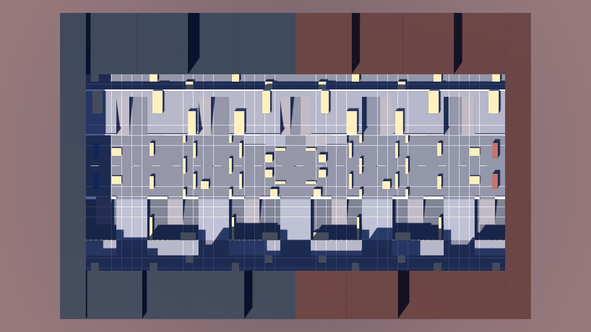

# Civic Dividend: Downtown (map design)

The arena is 184 x 120 m, authored for the west half and mirrored across x=0 (Helix west, Monarch east).
x runs west to east, z north (-) to south (+). Geometry is built only through `MapBuilder`
(`scripts/map_builder.gd`) from the data in `scripts/map_layout.gd`.

## Levels and routes

| Level | Height | What lives there |
|---|---|---|
| Sunken transit trench | y = -4 | Open-air trench (z 13..29) with tram cars, chicane baffles and three descent ramps per side; tunnels under the cross-street bridges |
| Street | y = 0 | Boulevard (z -12..12), cross streets at A/B/C (12 m), lobby cut-throughs, service alleys (z -36..-30 and 35..41) |
| Gallery | y = +3 | Awning ledge with a ramp at C: boulevard-side high ground |
| Roofs and skybridges | y = +6 | North roof route with parapets and penthouses; decks bridge the cross streets; ramps rise inside the cross streets |
| Perches | y = +9 | South block roofs, reachable only by grapple or parkour |

Five ways from a depot to the points: **boulevard**, **roof route**, **trench**, **north/south alleys**, plus lobby
cut-throughs as soft chokes. Every route family is verified to reach B and C from the Helix depot.

## Design principles and where they show up

- **Flanks:** three vertically separated lanes (roof, street, trench) and two service alleys, linked at every point by cross streets.
- **Choke points (all soft):** depot gates (6 m), tram portals on the boulevard, lobby cut-throughs (6 m), trench ramps (6 m), skybridge decks. Each has a bypass.
- **Sightlines:** tram portals on the boulevard and chicane baffles in the trench are pairs of offset walls, so no straight line crosses them. Alleys and roofs alternate cover side to side. Median free run is about 10 m everywhere; the longest lane-aligned run anywhere is 58 m.
- **High ground with a cost:** the C gallery (3 m) and roofs (6 m) overlook B and C but are exposed to grapples, smoke and the trench undercut. Capture requires street level, so high ground defends but never captures.
- **Spawn safety:** depot gates open onto a runway behind baffles; nothing in a depot can see the boulevard.
- **Class fit:** CQB for the Engineer's 12 m hose (alleys, trench, lobbies), 25-45 m rooms for the 35-45 m weapons, nothing beyond ~60 m.

## Geometry rules (enforced by `tests/map_audit.gd`)

1. Every solid is created by `MapBuilder`: mesh and collider share the same snapped (0.25 m) dimensions and are registered.
2. No interpenetrating blocks, no coplanar same-facing overlaps (z-fighting), no gaps between 0.05 and 2.0 m between parallel faces (wedge traps).
3. Ramps are wedge prisms (<= 22 degrees) with convex colliders; decals sit 4 cm proud of their surface.
4. Wall signs are flush on facades, never billboarded; non-colliding decor must touch a solid or lie outside the bounds.
5. Every waypoint has ground and capsule clearance (r 0.52); every edge is swept with a capsule and ground-sampled.
6. The east half exactly mirrors the west half; capture discs are flat street floor with no cover inside the 4.5 m radius.
7. Authoritative out-of-bounds kill (|x| > 93.5, |z| > 61.5, y > 40) keeps grapples and launch pads inside the arena.

## Movement reach (current tuning)

Jump apex about 1.9 m, double jump about +2.1 m, dash about 6 m, wall kick 10.5 m/s up, mantle up to about 2.6 m. The street,
gallery (3 m) and penthouses (2.8 m) are reachable on foot; 6 m roofs by wall-kick chains, grapple or ramps. Revisit parapet and
ledge heights after playtests.

## Tooling

- `tests/map_audit.gd` - geometry, clearance, connectivity, route diversity, sightline budgets.
- `tests/map_walk.gd` - a real `Fighter` (Skyrunner and Enforcer) walks every route family from both depots to every point using the game's movement code, without jumping.
- `tests/bot_routes.gd` - samples where bots are during a simulated match.
- `tests/perf_probe.gd` and `tests/soak.gd` - draw/primitive/node counts and a long-match leak check.
- `tests/render_map.gd` - top-down, isometric and eye-level shots into `docs/previews/`.
- `tests/proving_ground.gd` - open-floor fixtures at z=300 for movement/weapon tests, independent of the real map.

## Blender hook

`assets/README.md` documents the folder layout. Authored building/prop meshes replace procedural stand-ins only if they
keep the same collider footprint, since collision comes from `MapBuilder`, not from imported meshes.

Blockouts authored in Blender load through `scripts/blockout_importer.gd`; see `docs/BLENDER.md`.
