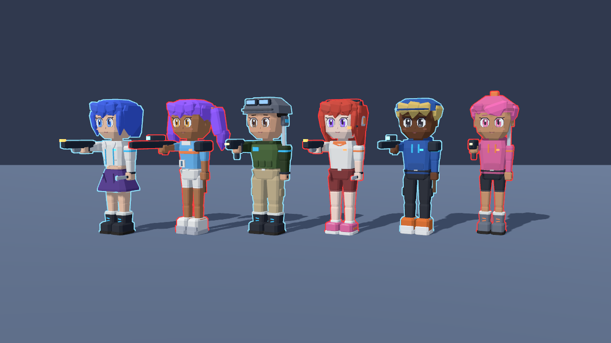
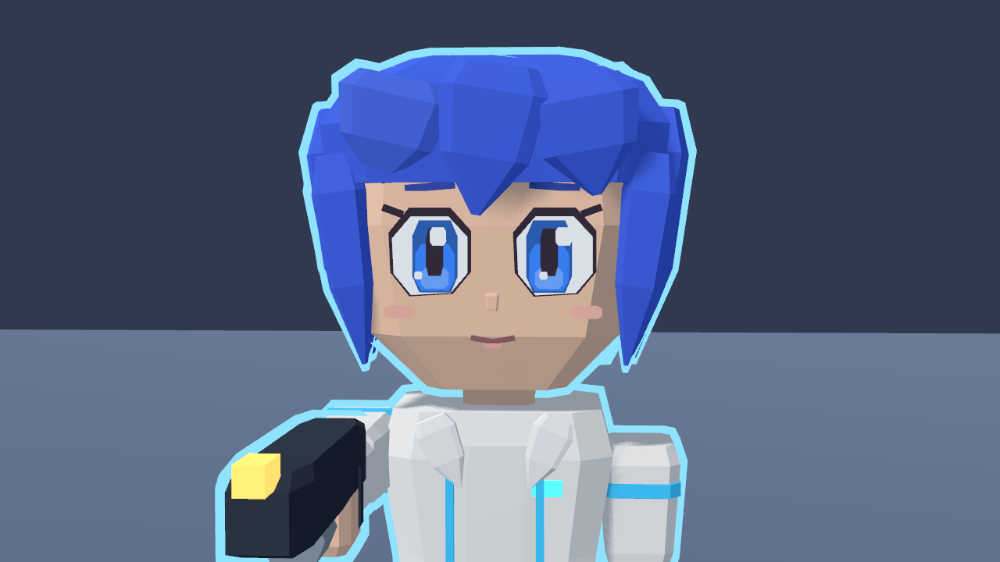
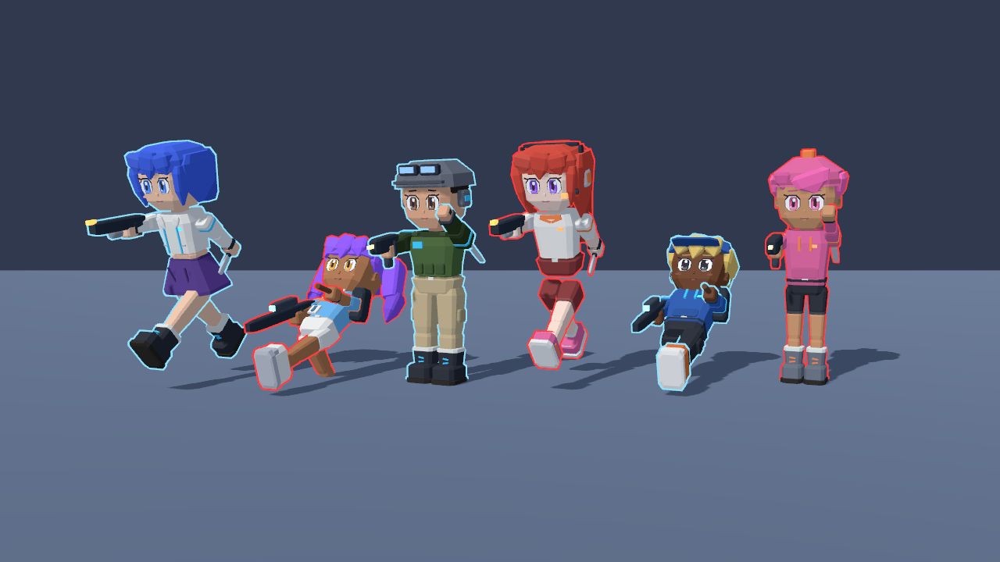

# Character design

The fighters use a cute, faceted low-poly style inspired by the supplied character references: expressive eyes,
a small smiling mouth, full cheeks tapering to a chin, pointed hair locks, fitted clothing and chunky footwear.
The shared silhouette has longer legs and narrower shoulders than the original block figures. Every existing build,
skin tone, hairstyle, accessory and garment remains available in the LOOK tab.



The default look pairs cobalt bobbed hair with a cream crop jacket, plum skirt and dark cuffed boots. This is the
fallback for players without a saved look; existing appearance codes and saved choices still use the same option
indices and packing. Team trim and a thinner ally/enemy outline keep fighters readable during a match.



## Procedural geometry

`scripts/character_rig.gd` extends the existing mesh baker rather than importing an asset or replacing the rig.
`Ctx.form` builds a part from chamfered rectangular rings. Each profile entry is a `Vector3` containing height
fraction, width fraction and depth fraction. Use `SOFT_PROFILE` for bevelled masses, `TAPER_PROFILE` for limbs and
`LOCK_PROFILE` for pointed hair; the face has its own cheek/chin profile. Ring faces receive flat normals.

`Ctx.patch` builds flat convex polygons for eyes, irises, highlights and blush. Successive layers sit slightly
forward on the face's -Z side. They avoid protruding eye boxes and stay on the existing detail surface. Garment
details can still use `Ctx.detail`, and guns still use the existing primary/sidearm attachment points.

Parts remain baked into one vertex-coloured mesh per bone with at most two surfaces. The behavioral suite checks
every appearance option for complete bones, finite geometry, clockwise nondegenerate triangles and a ceiling of
5,000 baked triangles and 16 mesh instances. It also checks the seated slide, return to standing, weapon aim,
melee pose and material fading.



Collision, health, movement tuning, the headshot threshold, snapshot keys and loadout behavior are unchanged.
The original bone paths drive the same run, jump, slide, aim and melee animations. All artwork remains procedural;
no texture, external model, plugin or image-generation dependency is required.

## Reproduce the previews

Run with a display using Godot 4.7.2:

```sh
godot --path . --rendering-method forward_plus --script res://tests/render_characters.gd
```

This writes `characters.png`, `characters_close.png` and `characters_poses.png` in `docs/previews/`. Forward+ is the
game's renderer; the script also works with `--rendering-method gl_compatibility --rendering-driver opengl3`.
