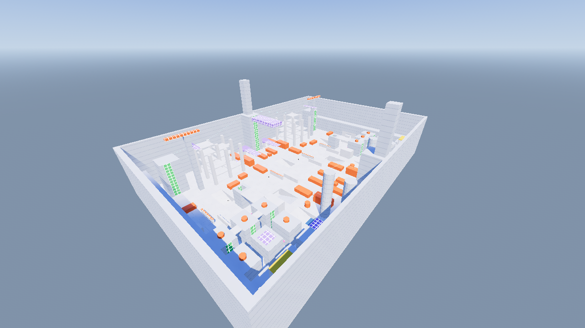

# Concrete Canopy: the jungle gym with a city skin

A 192 x 128 m greybox in which every piece of urban furniture is a traversal tool first and set dressing second.
Authored for the west half and mirrored across x = 0 (Helix west, Monarch east). Pick it in the start menu
(**Map: ... click to switch**) or copy `maps/canopy.blockout.json` to `maps/blockout.json`.



## Game mode (assumption: ask me to change it)

The map is built for the game's existing mode: **6v6 team objective, five capture points, bots fill empty slots**.
The objective unlocks from the centre outward, so the contest starts at C (the rail yard) and teams push toward A or A'.
Depots sit at both ends and nothing in a depot can see the street. **Explore mode** (single-player free roam, no bots) is the sandbox
for learning the verbs. A free-for-all would want more spawn points spread across districts instead of two sealed depots, and
a sandbox wants nothing from the objective at all. Say which you want and I will adapt spawns and loops.

## Movement grammar

One colour per verb, everywhere. Learn it once and it applies on the whole map.

| Verb | The furniture | What it does | Colour |
|---|---|---|---|
| Zipline | Power lines (zip) | Jump into the wire to hang from it, ride at up to 12-16 m/s in the direction you face, jump to let go with a hop | cyan |
| Grind rail | Power lines (grind) | Land on the rail from above to ride it standing at 14 m/s | cyan |
| Bounce | Awnings, shelters, billboard pads | Landing launches you 17 m/s (hop) or 23-24 m/s (to the roofs); some carry a sideways kick | magenta |
| Climb | Fire escapes, scaffolds, ladders, vent shaft, silo and spire ladders | Hold forward to climb at 6.5 m/s, back to descend, strafe to shuffle, jump to kick off; topping out steps you onto the platform | green |
| Perch | Billboards, signs, dock roofs | Standing room with long sightlines; fed by a bounce pad or a ladder | yellow |
| Moving platform | Elevators, trams, cranes, drawbridges, collapsing floors, the blimp | A platform on a keyframed timeline that carries whoever stands on it | violet |
| Tunnel | Subway | A fast, tight flank under the boulevard | orange strips |

Every climb lane draws its own ladder and every cable draws its own wire, so the grammar needs no manual dressing.
Tuning constants live at the top of `scripts/map_verbs.gd`.

## Four tiers, each connected to at least two others

| Tier | Height | What lives there | Connects to |
|---|---|---|---|
| Underground | y -6 | 180 m subway tunnel with staggered pillar pairs (tight, fast) | Street by three 20-degree stairwells, **roofs by the vent-tower shaft** (18 m climb) |
| Street | y 0 | Boulevard with offset barrier chicanes, rail yard lanes, market alleys, the canal, construction yard | everything |
| Mid-level | y 6 | Tram stations, tower plates, market bridges, hoist landings | Street (ladders, hoist, ramps), roofs (ladders, hoist) |
| Rooftops and sky | y 12 to 40 | Roof garden (one connected plateau), tower top plates, silo tops, spire docks, billboard perches, the blimp at y 34 | Mid and street by ladders, bounce awnings, zips and the hoist |

## Five districts

| District | Where | How it plays |
|---|---|---|
| **Rail Yard** | Centre, x -26..26, full length | Long N-S lanes between container stacks, two cover islands per lane, two timed trams on mid-level stations, the blimp overhead. Capture point C |
| **Construction Site** | North, x -86..-26, z -62..-14 | Vertical and exposed: a 24 m column frame with plates at 6/12/18/24 m, a zig-zag of four scaffold ladders, a hoist (ground to 18 m), a site office reached by ladder or zip, a crane mast and jib (41 m landmark) |
| **Market** | South outer, x -86..-51, z 16..62 | Tight 4 m alleys, a hollow market hall, awnings that launch to the roofs, fire escapes, mid-level bridges |
| **Rooftop Garden** | Over the market, y 12 | Open plateau of connected roofs with planters, roof bridges, a billboard perch, a skylight that collapses |
| **Flooded Industrial** | South inner, x -48..-26, z 14..60 | An 8 m canal pit with a ramp in, two drawbridges (chokepoints), silos with ladders (30 m landmarks), tanks as cover |

Landmarks visible from anywhere: the two **spires** (62 m, with climbable faces and blimp docks at 34 m), the **crane**, the **silos**.

## Flow and sightlines

- **Loops, not dead ends:** boulevard to market alleys and back; boulevard, stairwell, tunnel, stairwell, boulevard; roof loops by bridges and zips.
- **Highways over backroads:** zips and the blimp are fast and exposed; the tunnel and alleys are slow and safe from above.
- **Sightlines:** the boulevard has three offset barrier pairs (longest free run 36 m), the tunnel has pillar pairs (36 m), the rail yard lanes are long by design but broken by islands.
  Free runs are measured per lane in `settings.audit` in the map file (budgets in `tools/blender/maps/canopy.py`).

## Interactivity: three dramatic changes per match

| When | What | Announcement |
|---|---|---|
| 75 s (then every 150 s: up at 75, down at 135) | The canal **drawbridges lift** and stand upright, splitting the flooded zone | DRAWBRIDGES RAISING |
| 150 s (once) | The market hall **skylight collapses**, opening a route from the roof garden to the street | MARKET SKYLIGHTS COLLAPSING |
| 210 s (then returns at 276 s) | The **crane swings a 16 m span** between the site office roof and the tower's top plate | CRANES SWINGING SPANS INTO PLACE |

Always running: **trams** (56 s loop, dwell at each station), the **construction hoist** (40 s loop), the **blimp** (60 s loop, 12 s dwell at each dock).
Everything dynamic is a pure function of the match clock the server broadcasts, so a client needs no extra network traffic, and a restart resets it.

## What was verified (Godot 4.7, headless, with the real physics)

| Check | Result |
|---|---|
| `tests/map_audit.gd` on this map | 30 checks, 0 failures (geometry, clearance, waypoint edges, spawns, capture discs, sightline budgets) |
| `tests/map_walk.gd` | Skyrunner and Enforcer walk 64 routes, 0 failures |
| `tests/verbs_map.gd` | 333 checks, 0 failures: every one of 28 climb lanes tops out onto solid ground, 14 bounce pads reach their apex, 6 zips are ridden both ways and land the hero within 10 m of the far end, 4 grind rails carry the hero the full length, and every trams/hoist/blimp carries a standing hero; both heroes |
| `tests/verbs_test.gd`, `run_tests.gd`, `network_test.gd`, `blockout_import.gd` | pass |
| `match_smoke.gd` on this map | bots leave the depots, contest points and capture them |
| Blender round trip (`tools/blender/test_roundtrip.py`, real Blender 5.0) | 183 objects, 60 waypoints and 37 features survive import and export unchanged |

Greybox tests with the **fastest hero (Skyrunner) and the heaviest (Enforcer)** found and fixed geometry problems rather than hero tuning:
the Enforcer's wider capsule clipped the blimp hull at the spire ladder (blimp docks moved 2 m off the faces), and awnings sat under a roof bridge that cut their launch short.

## Not done yet

- **Hijackable elevators and shutters.** The hoist and tram are on a fixed timeline; letting a team call or hold them needs a small server state.
- **Pickups at dead ends.** The game has no pickup system yet.
- **Bots only use walk and ramp routes** (stairs, boulevard, alleys, tunnel). They do not use ziplines, ladders or bounce pads, so mid and roof tiers are for players.
- Water is a coloured floor; there is no swimming or slowing.
- It has not been play-tested by people. The numbers (bounce power, zip speed, dwell times) are first guesses.

## Rebuilding and testing

```
python3 tools/blender/generate.py tools/blender/maps/canopy.py maps/canopy.blockout.json     # regenerate (or --blend to open in Blender)
cp maps/canopy.blockout.json maps/blockout.json                                              # developer override of the menu choice
godot --headless --fixed-fps 60 --path . --script res://tests/map_audit.gd
godot --headless --fixed-fps 60 --path . --script res://tests/verbs_map.gd
godot --headless --fixed-fps 60 --path . --script res://tests/map_walk.gd
```

In-engine screenshots: `VK_ICD_FILENAMES=/usr/share/vulkan/icd.d/lvp_icd.json xvfb-run -a godot --path . --script res://tests/render_canopy.gd`
writes `docs/previews/canopy_*.png` (top, iso, street, tunnel, each district, and the three events).
