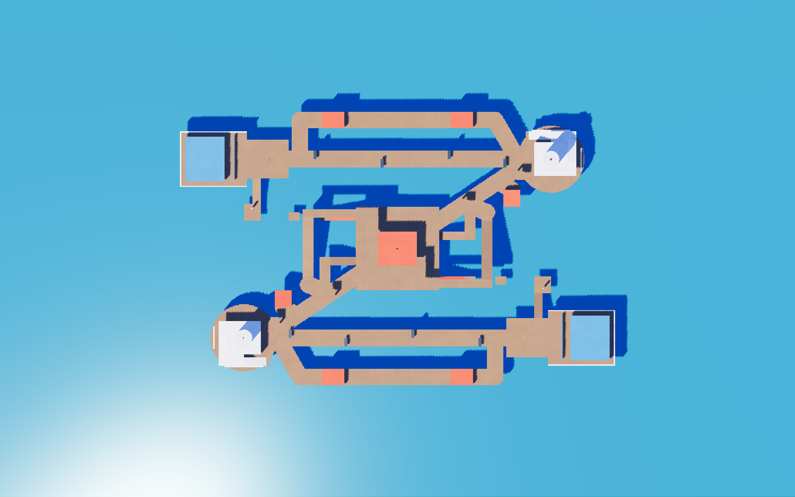
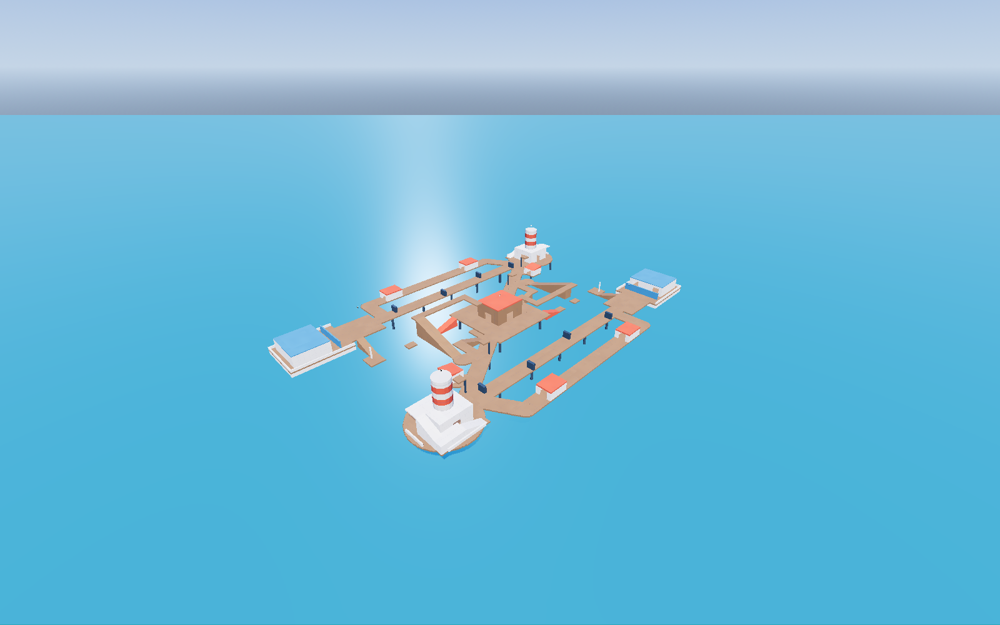
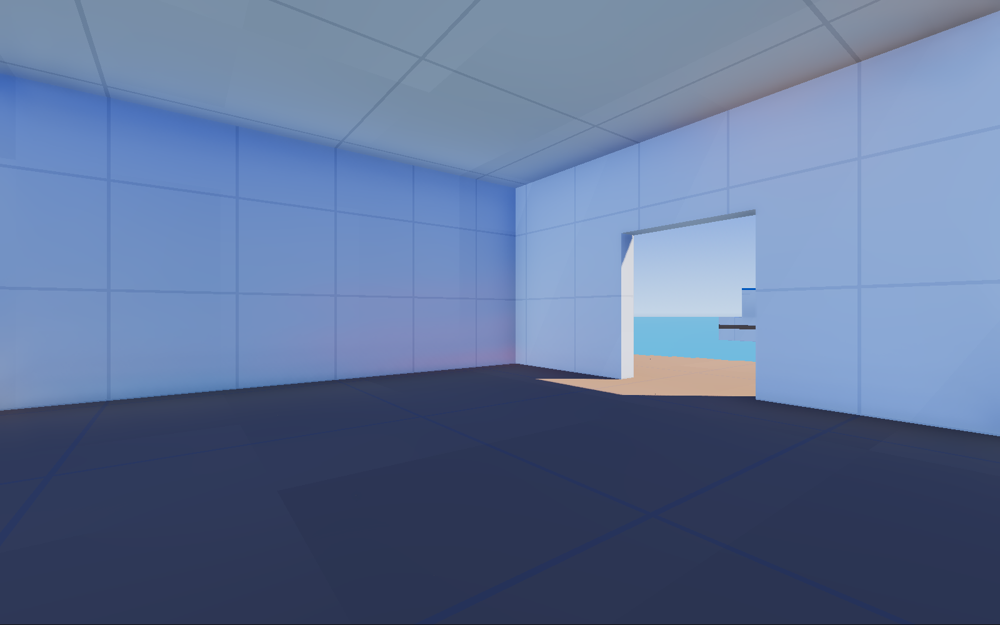
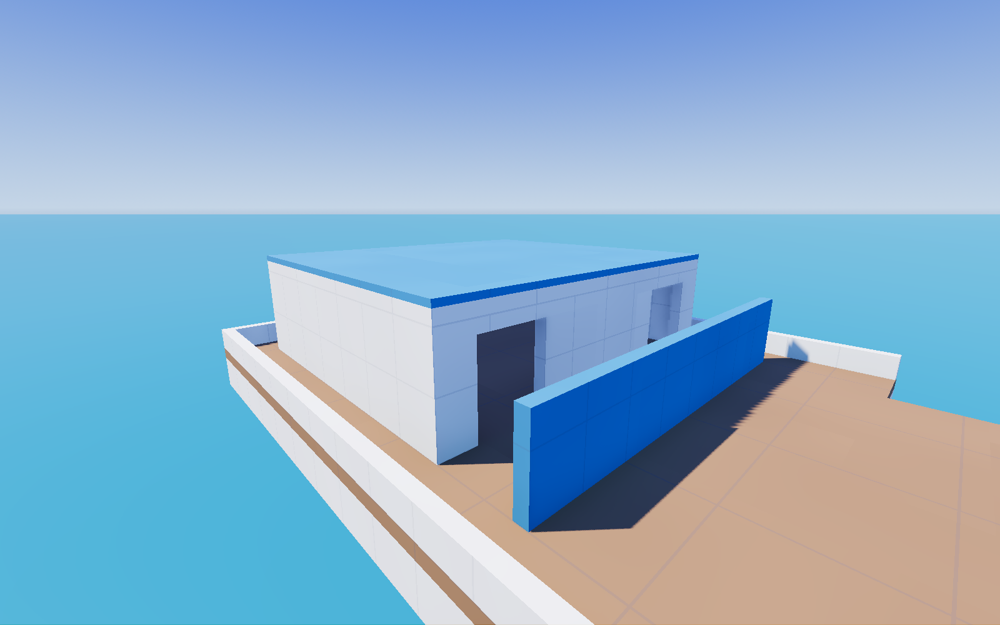
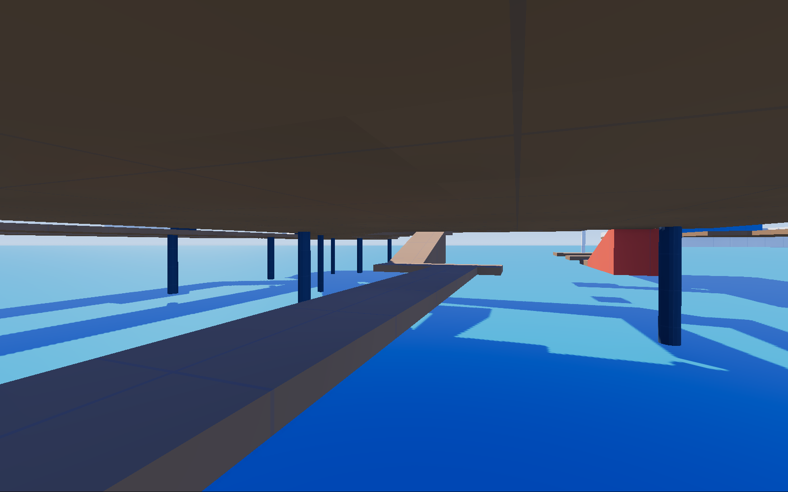

# Yacht Club

Select **Yacht Club** in the start menu, then Play offline, Explore map, or Host LAN. Joining machines must select
the same map before connecting. The 160 × 110 m marina has 180-degree rotational symmetry, five-point Acquisition
and lethal ocean. The reference is the [shared Z-shaped design](https://chatgpt.com/share/6ac819ce-71e0-83ea-bc87-460cf31a5c55).

## Objectives and landmarks

Coordinates use x east, z south, y up; the main floor is y = 0. Helix starts northwest and Monarch southeast.
Helix advances C → D → E; Monarch advances C → B → A. A/E are final objectives outside the protected cabins.

| Landmark | Center (x, z) | Geometry |
|---|---:|---|
| Helix yacht | (-66, -32) | 24 × 20 m deck, hollow white cabin, two shielded exits |
| A: Helix landing | (-46, -32) | 14 × 14 m landing connected to both exits |
| B: northeast lighthouse | (55, -32) | 24 m island, hollow 12 × 12 m base; west, north and south doors |
| C: shack | (0, 0) | 30 × 30 m island; 14 × 12 m shack, four doors, roof y = 7 |
| D: southwest lighthouse | (-55, 32) | Rotated copy of B, including doors and balcony access |
| E: Monarch landing | (46, 32) | Rotated copy of A |
| Monarch yacht | (66, 32) | Rotated copy of Helix yacht |

Lighthouse walls are 0.5 m thick with three 3 m doorways. The ceiling begins at y = 5.5; the balcony is y = 6.
A striped 6 m diameter tower reaches y = 16. Capture discs retain the existing 4.5 m radius and vertical occupancy
limit; the roof, balconies and underdock cannot capture. Doors, supports and ramps leave the discs unobstructed.

The main six-metre boardwalks and diagonal lighthouse–shack spine provide continuous walking routes. Covered shed
loops flank the boardwalks. Staggered cover and partial rails break sightlines while exposed edges allow knockback
plays. Four shed health packs use the existing health rules. One timed power pickup sits at (0, -3, 0), beneath C.

The underdock has a continuous 3 m catwalk at y = -3 and paired nine-metre ramps with 3 m rise (18.4°).
Shack roof access uses 21 m ramps rising 7 m (18.4°). Lighthouse flights rise 3 m over 8 m (20.6°).

## Water and spawns

Water is a visual plane at y = -8 with no collider or floor. Authority eliminates fighters below it even in Explore,
through armor, invulnerability and debug protection. Recovery remains possible above the threshold. The latest
enemy projectile blast, melee push or Breach Charge push within six seconds earns an ocean elimination; otherwise
the feed reports Ocean. Attribution stays on the server and clears on death, respawn and loadout replacement.

Helix's five slots are (-68, 0.2, -37 + 2.5 × slot); Monarch rotates them through the origin. Cabin protection is
[-76,-1,-40] to [-62,4,-24], plus its rotated copy. Loadout changes are accepted inside these cabins or while dead.
Exit baffles hide spawn slots from the landings and tested combat lanes. All landing capture discs are outside protection.

## Measured routes

`tests/yacht_club.gd` uses real Fighter movement at 60 Hz and real authoritative rockets/grapple raycasts. Fixtures
start at the stated launch position and, for run-up trials, an established 8–9 m/s approach; times exclude that run-up,
combat and recovery between attempts. Air steering turns toward the landing early to cancel sideways momentum.
Every trial also passes on the rotated side. These are automated traversal timings, not human match averages.

| Route | Successful input / endpoints | Time |
|---|---|---:|
| Lighthouse → shack, walking | B → diagonal nodes → east shack door → C; W, no jumps | Shotgun 9.33 s; SMG 8.55 s |
| Exterior lighthouse balcony | West approach → two ramp flights → balcony | Shotgun 6.08–6.12 s; SMG 6.03 s |
| Shack roof, walking | (24,0,-16) → (32,0,-10) → ramp → roof bridges | Shotgun 9.58–9.65 s; SMG 8.97–9.02 s |
| 7 m beam hop | Start (25,-3,11.5); Shift + W; Space near x = 27; land on x = 35–39 beam | 1.23 s, Shotgun and SMG |
| 10 m grapple gap | Start (37,-3,11.5); hook mast near (52.25,1.75,14.25), Space + W; release over x = 50 | 1.10 s |
| 10 m rocket gap | Same beam; fire down/back, Space, then double jump at descent; steer onto far platform | 1.95 s |
| Lighthouse wall-kick transfer | (51.4,6,-32); Space, kick off tower with Space, double jump after 0.4 s; land (44,5.5,-26) | 1.65 s |
| Boathouse launch | (41,3.5,-18) roof; run west, rocket down/back, Space then double jump at descent; land (24,5.5,-16) | 1.73 s |

The paired red Death Dive ramps feed the lower beam-hop lanes. The seven-metre gap is measured edge to edge between
x = 28 and 35; the ten-metre gap lies between x = 39 and 49. A ramp returns the far grapple platform to the yacht landing.
Advanced launches are optional and have no role in mandatory objective routing.

## Authoring and verification

`tools/blender/maps/yacht_club.py` is the source of truth. It unions deck cells on the 0.25 m grid and partitions them
into adjoining rectangles, then rotates geometry and graph links. The generated map contains 573 solids, 98 waypoints
and five pickups. Collision is built entirely by MapBuilder. No movement or weapon tuning changed.

```
python3 tools/blender/generate.py tools/blender/maps/yacht_club.py maps/yacht_club.blockout.json --strict
python3 tools/blender/test_blockout_kit.py
python3 tools/blender/test_export_blockout.py
godot --headless --path . --editor --quit
godot --headless --path . --script res://tests/run_tests.gd
godot --headless --path . --script res://tests/blockout_import.gd
godot --headless --path . --script res://tests/map_audit.gd -- --map=res://maps/yacht_club.blockout.json
godot --headless --path . --script res://tests/map_walk.gd -- --map=res://maps/yacht_club.blockout.json
godot --headless --fixed-fps 60 --path . --script res://tests/yacht_club.gd -- --map=res://maps/yacht_club.blockout.json
godot --headless --fixed-fps 60 --path . --script res://tests/match_smoke.gd -- --map=res://maps/yacht_club.blockout.json
godot --headless --fixed-fps 60 --path . --script res://tests/soak.gd -- minutes=2 --map=res://maps/yacht_club.blockout.json
# Start server first, then client; both use the same map.
godot --headless --path . --script res://tests/network_test.gd -- --server --latency-ms=80 --drop-every=5 --map=res://maps/yacht_club.blockout.json
godot --headless --path . --script res://tests/network_test.gd -- --latency-ms=80 --drop-every=5 --map=res://maps/yacht_club.blockout.json
godot --path . --resolution 1600x1000 --script res://tests/render_yacht_club.gd -- --map=res://maps/yacht_club.blockout.json
```

Run the behavioral suite on the built-in map: some existing tests deliberately use its depot coordinates. Yacht Club
has its own scenario suite. `maps/blockout.json` takes precedence over the menu and command-line map override.
See [validation results](../VALIDATION.md) for counts, hardware and unavailable checks.

Reference differences: door baffles and outer shed loops make spawning and walking practical; diagonal piers have
grid-stepped edges; ordinary ramp routes supplement aerial shortcuts; transfer pads and a grapple mast are explicit
graybox affordances. The reference's route timings target lighthouse-to-shack travel, not every adjacent objective.
Boat models remain simple procedural hulls/cabins. Swimming, moving boats and detailed external art are outside this version.

## Previews






